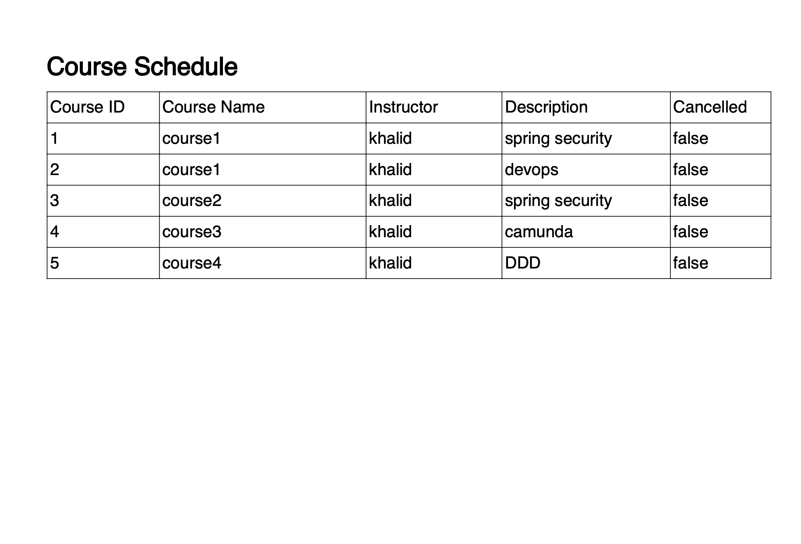

# Student Management System
## Project Overview
This Student Management System (SMS) is a comprehensive application designed to manage student information, course registrations, and user authentication. The system supports the following features:

- User registration and authentication
- Course viewing and registration
- Bulk course registration with schedules
- Course cancellation
- PDF generation of course schedules

## Technical Stack
- **Backend:** Java 8+ with Spring Boot
- **Database:** Oracle Database
- **Authentication:** JWT (JSON Web Tokens)
- **Data Caching:** [Choose your caching framework, e.g., Ehcache, Caffeine]
- **PDF Generation:** [Specify your PDF generation library, e.g., iText, Apache PDFBox]
- **Dependency Management:** Maven

## Features
### User Authentication
- Register users with unique usernames and passwords.
- Secure login with JWT for stateless authentication.

### Course Management
- View all available courses.
- Register for courses.
- Cancel course registrations.

### Schedule Management
- Manage course schedules with relational database implementation.
- Generate and download course schedules as PDF documents.

## Enhancements & Future Work
1. **Improved User Interface:**
    - Consider building a front-end application using frameworks like React, Angular, or Vue.js for a more interactive user experience.

2. **Role-Based Access Control (RBAC):**
    - Implement roles (e.g., Admin, Student) to restrict access to certain functionalities based on user roles.

3. **Email Notifications:**
    - Add email notifications for user registration confirmation, course registration, and cancellations.

4. **API Documentation:**
    - Utilize tools like Swagger or OpenAPI to document your RESTful APIs for easier integration and testing.

5. **Data Validation:**
    - Use validation annotations (e.g., `@NotBlank`, `@Size`, `@Email`) for user inputs to ensure data integrity.

6. **Unit and Integration Tests:**
    - Write comprehensive test cases using JUnit and Mockito to ensure the application works as intended and to avoid regressions.

7. **Dockerization:**
    - Create a Dockerfile and docker-compose configuration to allow for easy deployment and scalability.

8. **Versioning API:**
    - Consider versioning your API to allow for future updates without breaking existing client applications.

## How to Run the Project
1. Clone the repository:
   ```bash
   git clone <https://github.com/khalidnouh/student-management-system.git>
   
# APIs Examples :

### Registere a user
	> POST - ${appUrl}/student-management/api/users/register
    {
    "username": "user",
    "password": "1234",
    "email":"aa@mm.com"
    }
### Login Api
	> POST - ${appUrl}/student-management/api/auth/login
    {
    "username": "user",
    "password": "1234"
    }
### Add Course
	> POST - ${appUrl}/student-management/api/courses
    {
    "name": "course1",
    "instructorName": "khalid",
    "description": "spring security"
    }
### Add Courses as a Bulk
	> POST - ${appUrl}/student-management/api/courses/bulk
    [
    {
        "name": "course1",
        "instructorName": "khalid",
        "description": "devops"
    },
    {
        "name": "course2",
        "instructorName": "khalid",
        "description": "spring security"
    },
    {
        "name": "course3",
        "instructorName": "khalid",
        "description": "camunda"
    },
    {
        "name": "course4",
        "instructorName": "khalid",
        "description": "DDD"
    }
]

### Get All Courses
	> GET - ${appUrl}/student-management/api/courses

### Get All Courses
	> GET - ${appUrl}/student-management/api/courses

### Register a Course 
    > POST - ${appUrl}/student-management/api/courses/1/register

### Cancel a Regestration for specific Course 
    > PUT - ${appUrl}/student-management/api/courses/1/cancel

### Get course schedule as PDF 
    > GET - ${appUrl}/student-management/api/courses/schedule/pdf

